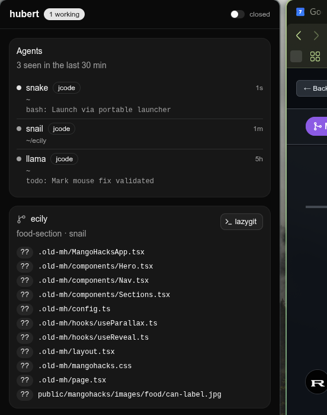

<div align="center">
  

  # Hubert

  **A native desktop dashboard and voice control for your coding agents.**

  Watch live [jcode](https://github.com/1jehuang/jcode), [Claude Code](https://claude.com/claude-code), [Codex](https://github.com/openai/codex), [Cursor](https://cursor.com), [oh-my-pi](https://github.com/can1357/oh-my-pi), [Pi](https://pi.dev) and [OpenCode](https://opencode.ai) sessions, changed files, commands and diffs in one window. Talk to your agents instead of hunting for terminals.

  [](LICENSE)
  
  

  [Install](#install) · [Features](#features) · [Voice](#voice-control) · [Settings](#settings) · [Configuration](#configuration) · [Contributing](CONTRIBUTING.md)
</div>



## Features

- **Agents.** Every active session across your coding agents, working or idle, and what it just did. Click a jcode agent to focus its tmux window.
- **Live diff.** Line-numbered, color-coded changes against `HEAD`, including untracked files. Refreshes about every 1.5 seconds.
- **Change map.** Per-repository graph linking agents to changed files, with edit counts from observed journal edit tools.
- **Commands.** Recent completed Bash calls with duration, a failures filter, and expandable raw command and error output.
- **Voice control.** Push to talk: "focus snail", "what is snake doing", "tell llama to review the nav". Actions that change things ask first.
- **Settings.** Hold or toggle to talk, a rebindable in-app shortcut, saved on your device.
- **Its own window.** GTK4 + WebKitGTK app window, not a browser tab. Local-only, nothing is sent anywhere unless you configure a cloud speech provider.

Hubert reads each agent's local session files plus git state for repositories that have a live agent. A session is **working** after recent transcript activity and **idle** when quiet.

## Install

**Requires:** [Bun](https://bun.sh) 1.3+, git, Python 3 with PyGObject, and WebKitGTK 6.

```sh
# Fedora
sudo dnf install python3-gobject webkitgtk6.0
# Debian / Ubuntu
sudo apt install python3-gi gir1.2-webkit-6.0

git clone https://github.com/red0-x/hubert.git
cd hubert
bun install
./hubert.sh
```

`hubert.sh` starts the local server on `127.0.0.1:7777` and opens the window. Running it again focuses the existing window. Optional: [ffmpeg](https://ffmpeg.org) for voice input, tmux for focusing agents, [lazygit](https://github.com/jesseduffield/lazygit) for the lazygit button, Hyprland for window arrangement.

macOS has no WebKitGTK window yet. Run `bun start` and open `http://127.0.0.1:7777`. This is untested.

## Supported agents

| Agent | Shows up | Focus (tmux) | Send message | Interrupt | Verified |
| --- | --- | --- | --- | --- | --- |
| [jcode](https://github.com/1jehuang/jcode) | `~/.jcode` | yes | yes | yes, via the [jcode SDK](https://www.npmjs.com/package/@1jehuang/jcode-sdk) | live |
| [Claude Code](https://claude.com/claude-code) | `~/.claude/projects` | no | no | no | real files |
| [Codex](https://github.com/openai/codex) | `~/.codex/sessions` | no | no | no | real rollout file |
| [oh-my-pi](https://github.com/can1357/oh-my-pi) | `~/.omp/agent/sessions` | no | no | no | docs only |
| [Pi](https://pi.dev) | `~/.pi/agent/sessions` | no | no | no | docs only |
| [OpenCode](https://opencode.ai) | `~/.local/share/opencode/opencode.db` (1.17+) | no | no | no | docs only |
| [Cursor](https://cursor.com) | `~/.cursor/projects/*/agent-transcripts` | no | no | no | docs only |

Only jcode exposes an inbound control API, so message and interrupt are jcode-only for now. "Docs only" means the reader follows the published session layout but has not been run against a real install. If one breaks for you, open an issue with a redacted sample line.

Interrupting needs the jcode harness bridge. `hubert.sh` starts `jcode api-bridge` for you if it is not already running.

## Voice control

Hold the mic button (or your shortcut) and speak. Simple requests such as focusing an agent or asking for status use a fast grammar. Anything else can go to a tool-less jcode model that proposes a plan, which Hubert checks against live agents and windows before running it.

- Focus and status run immediately. Sending a message, interrupting an agent, and moving or resizing a window need a click on **Do it**.
- Hubert does **not** open or close windows or agents by voice. Hyprland arrangement is limited to validated move and resize.
- Choose a speech-to-text connector with `HUBERT_STT`:

| Variable | Purpose |
| --- | --- |
| `HUBERT_STT` | `whisper-socket`, `command`, `openai-compatible`, `groq`, `openai`, or `deepgram`. Default is the first configured **local** connector. |
| `HUBERT_STT_SOCKET` | Warm local Whisper Unix socket. Defaults to `~/.jcode/dictation/whisper.sock` when present |
| `HUBERT_STT_COMMAND` | Local command with a `{wav}` placeholder, e.g. `whisper-cli -m model.bin -f {wav}` |
| `HUBERT_STT_URL`, `_KEY`, `_MODEL` | OpenAI-compatible endpoint, optional key and model |
| `HUBERT_BRAIN` | Set `off` to disable model planning |
| `HUBERT_BRAIN_MODEL`, `HUBERT_BRAIN_PROVIDER` | Override the planning model |

Cloud providers also need `GROQ_API_KEY`, `OPENAI_API_KEY` or `DEEPGRAM_API_KEY`. Add a connector in [`voice/stt.ts`](voice/stt.ts).

## Settings

Click the gear in the header. Pick **hold to talk** or **toggle to talk** and rebind the shortcut. The shortcut works only while Hubert is focused. A system-wide shortcut is on the roadmap.

## Configuration

| Variable | Default | Purpose |
| --- | --- | --- |
| `HUBERT_PORT` | `7777` | Local server port |
| `HUBERT_TERMINAL` | first supported terminal | Command prefix for the lazygit button |
| `HUBERT_DEVTOOLS` | unset | Set to `1` for WebKit inspector in the window |
| `JCODE_HOME` | `~/.jcode` | jcode data directory |
| `CLAUDE_CONFIG_DIR` | `~/.claude` | Claude Code data directory |
| `CODEX_HOME` | `~/.codex` | Codex data directory |
| `CURSOR_HOME` | `~/.cursor` | Cursor data directory |

## Privacy and safety

The server binds to loopback and rejects foreign `Host` and `Origin` headers. Local speech connectors keep audio on your machine. Cloud connectors send it to the provider you chose. If the grammar cannot handle a request and the brain is on, the transcript, live agent names and recent tool activity go to the selected model through jcode. Set `HUBERT_BRAIN=off` to avoid that. Report vulnerabilities privately through GitHub security advisories.

## Known limits

- Edit counts come from recent journal tails and miss edits made through shell commands.
- Focus works for jcode agents in titled tmux panes. Other agents are shown but cannot be focused, messaged or interrupted.
- The command list reads only jcode and Claude Code journals. The change map also counts Codex patch edits. Omp, Pi, OpenCode and Cursor appear in the agent list and in changed files by working directory only.
- Voice has been tested with a local Whisper socket. Groq, OpenAI and Deepgram are covered by mock-server tests only.
- Mic permission and the in-app shortcut were checked in the WebKitGTK window, but no end-to-end transcription (no speech connector is configured on the dev machine).

## Roadmap

Global push to talk through a Hyprland keybind · per-agent edit attribution · agent-to-agent relay with loop guards · richer command history and stats · macOS window · command and edit parsing for Codex, omp, Pi, OpenCode and Cursor · message and interrupt for agents that gain a control API.

## Contributing

Issues and pull requests are welcome. See [CONTRIBUTING.md](CONTRIBUTING.md) for setup, tests, project layout, and the rules that keep Hubert safe (local-only, no voice-driven window or agent creation or termination).

## License

[MIT](LICENSE)
